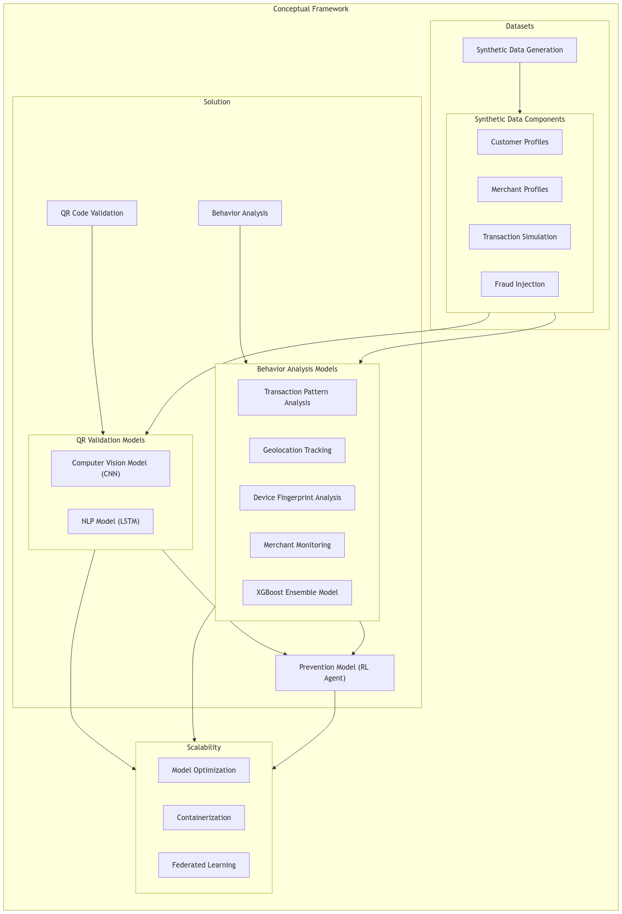

# AI Quest 25  

## Overview  
This repository contains the **technical reports** for the AI Quest 25 competition, held at the Higher Institute of Sciences (HIS) and organized by GDG SBA and No Limit Club (NLC).  

AI Quest 25 was a multidisciplinary AI challenge featuring various quests, including:  
- **Main Quest**: Securing QR-code-based mobile financial transactions using AI.  
- **Additional Quests**:  
  - CTF-style challenges.  
  - Kaggle-style challenges (Natural Language Processing, Audio Classification, Time Series).  
  - Optimization tasks (Hyperparameter tuning using Genetic Algorithms, Scheduling Problems).  
  - Quantum Machine Learning.  

## Repository Contents  
1. **Main Quest**:  
   - Technical report detailing the multimodal AI system, including malicious QR-code detection, URL analysis, fraud detection, and simulation for fraud prevention.  

2. **Genetic Algorithm for Hyperparameter Tuning**:  
   - Technical report explaining the methodology and results of creating a hyperparameter tuning algorithm using Genetic Algorithms.  

## Highlights of the Main Quest  
Our multimodal AI solution includes:  
- **Malicious QR-code Detection**: Convolutional Neural Networks (CNNs).  
- **Malicious URL Detection**: Long Short Term Memory Networks (LSTM).  
- **Fraud Detection**: Machine Learning-based fraud detection in a custom-engineered dataset.  
- **Fraud Prevention Simulation**: Reinforcement Learning-powered environment for transaction simulation.  

## Solution Framework  
Below is a visual representation of the overall solution architecture used in the main quest:  

  

## Contribution  
Feel free to explore the reports and suggest improvements or discuss ideas related to the competition.  

---

Let me know if you need additional changes! 😊